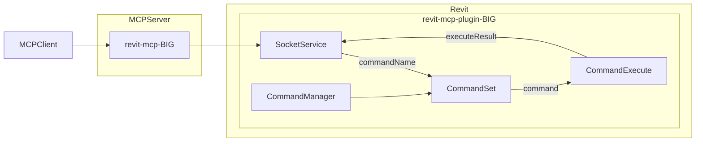

# revit-mcp-BIG

> Forked from [mcp-servers-for-revit/revit-mcp](https://github.com/mcp-servers-for-revit/revit-mcp)
> Extended by [YonseiBIG](https://github.com/YonseiBIG) with NADIA tools for BIM element type management

English | [简体中文](README_zh.md)

## What's Added (YonseiBIG)

This fork adds **17 new MCP tools** ported from the NADIA_SK Revit plugin, covering three categories:

### Query Tools (7)
| Name | Description |
|---|---|
| `get_rooms_by_name` | Get rooms by their names |
| `get_levels_by_name` | Get levels by their names |
| `find_elements_by_level` | Find elements (wall/beam/column/floor) associated with specific levels |
| `find_elements_by_room` | Find elements (wall/floor) associated with specific rooms via boundary geometry |
| `find_hosted_elements` | Find doors/windows hosted on specific walls |
| `get_adjacent_rooms` | Get rooms adjacent to a specific element |
| `get_elements_by_type` | Get all instances of a specific element type |

### Type Change Tools (6)
| Name | Description |
|---|---|
| `change_wall_type` | Change WallType of existing wall instances |
| `change_beam_type` | Change FamilySymbol of existing beam instances |
| `change_column_type` | Change FamilySymbol of existing column instances |
| `change_door_type` | Change FamilySymbol of existing door instances |
| `change_floor_type` | Change FloorType of existing floor instances |
| `change_window_type` | Change window family while preserving original dimensions |

### Type Creation Tools (4)
| Name | Description |
|---|---|
| `create_wall_type` | Create new WallType with compound structure layers (material name based) |
| `get_wall_type_info` | Get wall type compound structure details (layers, materials, thickness) |
| `create_door_type` | Create new door type with specified dimensions |
| `create_window_type` | Create new window type with specified dimensions |

---

## Description

revit-mcp allows you to interact with Revit using the MCP protocol through MCP-supported clients (such as Claude, Cline, Cursor, etc.).

This project is the server side (providing Tools to AI), and you need to use [revit-mcp-plugin-BIG](https://github.com/YonseiBIG/revit-mcp-plugin-BIG) and [revit-mcp-commandset-BIG](https://github.com/YonseiBIG/revit-mcp-commandset-BIG) in conjunction.

## Features

- Allow AI to get data from the Revit project
- Allow AI to drive Revit to create, modify, and delete elements
- **Query elements by Room, Level, and host relationships** (NEW)
- **Change element types (wall, beam, column, door, floor, window)** (NEW)
- **Create new wall/door/window types with specific parameters** (NEW)
- Send AI-generated code to Revit to execute

## Requirements

- nodejs 18+

> Complete installation environment still needs to consider the needs of revit-mcp-plugin, please refer to [revit-mcp-plugin-BIG](https://github.com/YonseiBIG/revit-mcp-plugin-BIG)

## Installation

### 1. Build local MCP service

Install dependencies

```bash
npm install
```

Build

```bash
npm run build
```

### 2. Client configuration

**Claude / Cursor client**

```json
{
    "mcpServers": {
        "revit-mcp": {
            "command": "node",
            "args": ["<path to the built file>\\build\\index.js"]
        }
    }
}
```

## Framework



## All Supported Tools

### Original Tools
| Name | Description |
|---|---|
| get_current_view_info | Get current view info |
| get_current_view_elements | Get current view elements |
| get_available_family_types | Get available family types in current project |
| get_selected_elements | Get selected elements |
| create_point_based_element | Create point based element (door, window, furniture) |
| create_line_based_element | Create line based element (wall, beam, pipe) |
| create_surface_based_element | Create surface based element (floor, ceiling) |
| delete_elements | Delete elements |
| send_code_to_revit | Send code to Revit to execute |
| color_splash | Color elements based on a parameter value |
| tag_walls | Tag all walls in view |

### Added Tools (YonseiBIG)
See [What's Added](#whats-added-yonseibig) section above.

## License

MIT

## Credits

- Original project: [mcp-servers-for-revit](https://github.com/mcp-servers-for-revit)
- Extended by: [YonseiBIG](https://github.com/YonseiBIG)
